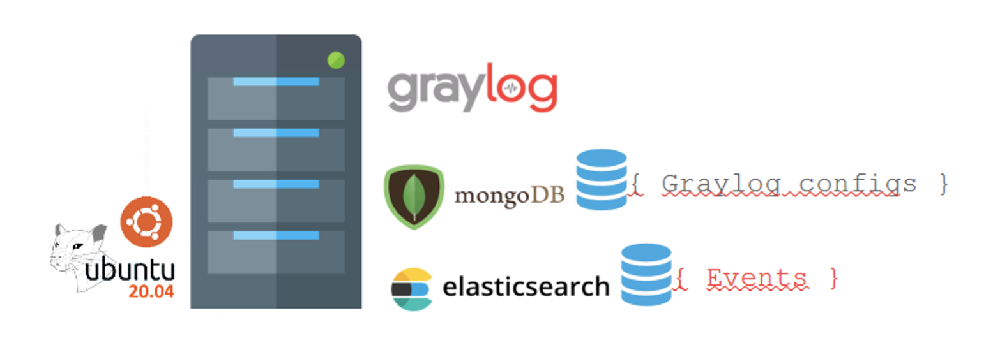
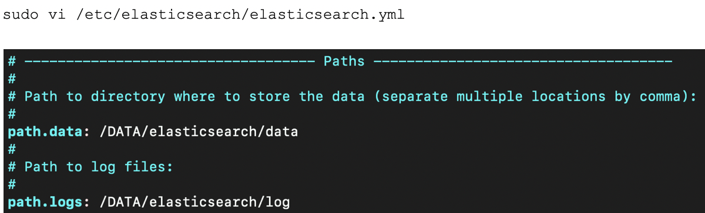
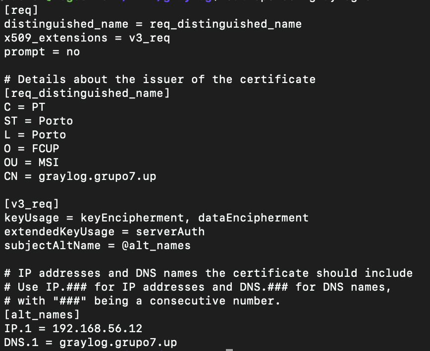

# Graylog Setup
Sharing some notes about graylog server setup...

## Install Elasticsearch

curl -fsSL https://artifacts.elastic.co/GPG-KEY-elasticsearch | sudo apt-key add -

echo "deb https://artifacts.elastic.co/packages/7.x/apt stable main" | sudo tee -a /etc/apt/sources.list.d/elastic-7.x.list

sudo apt update
sudo apt install elasticsearch

### Configure elastichsearch disk

sudo systemctl start elasticsearch
sudo systemctl enable elasticsearch
 
## Install MongoDB

wget -qO - https://www.mongodb.org/static/pgp/server-4.4.asc | sudo apt-key add -

echo "deb [ arch=amd64,arm64 ] https://repo.mongodb.org/apt/ubuntu focal/mongodb-org/4.4 multiverse" | sudo tee /etc/apt/sources.list.d/mongodb-org-4.4.list

sudo apt update

sudo apt install -y mongodb-org

## Install Graylog

sudo apt-get install apt-transport-https openjdk-8-jre-headless uuid-runtime pwgen

wget https://packages.graylog2.org/repo/packages/graylog-4.0-repository_latest.deb

sudo dpkg -i graylog-4.0-repository_latest.deb

sudo apt update && sudo apt install graylog-server

### Configure TLS
vi openssl-graylog.cnf

openssl req -x509 -days 365 -nodes -newkey rsa:2048 -config openssl-graylog.cnf -keyout pkcs5-plain.pem -out cert.pem

* Add certificate to JVM trusted CA
sudo keytool -importcert -keystore /usr/lib/jvm/java-1.8.0-openjdk-amd64/jre/lib/security/cacerts -alias graylog-self-signed -file /DATA/graylog/cert.pem 
(Default password: changeit)

